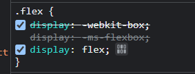
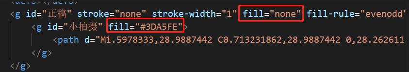
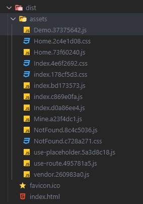
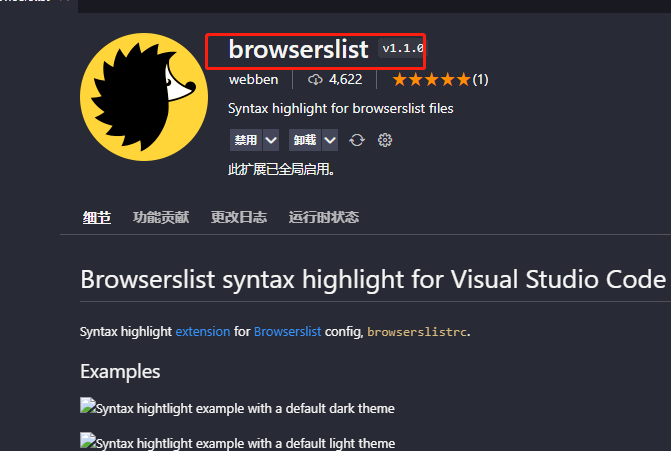
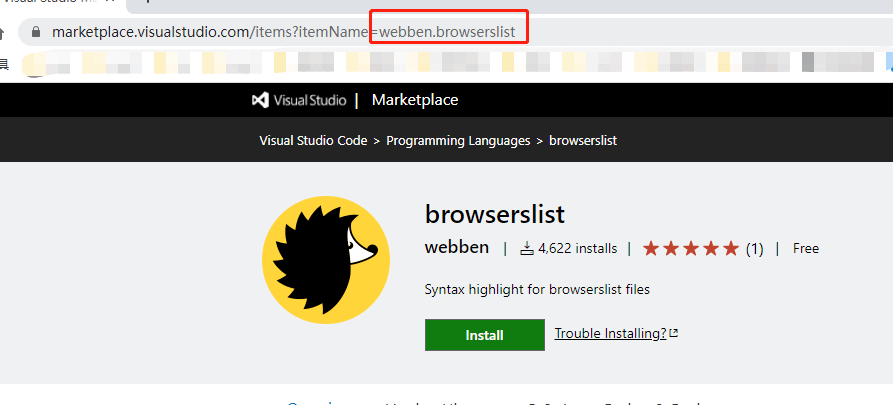
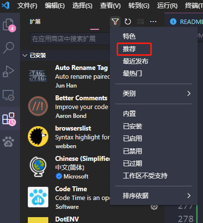
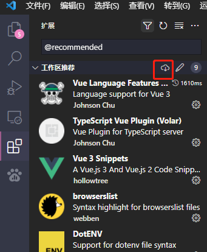

# vue3-mobile-tmpl

基于 create-vue，执行 `npm init vue@next` 创建工程

esModule的兼容性: [can I use](https://caniuse.com/?search=es%20module)

安装下 vue 全家桶和必要的包
```shell
npm i vue@next vue-router@next pinia vant@next
```

## 封装历程
[x] git提交规范
[x] 按需加载vant
[x] vuex改为pinia
[x] 怎么规范ts和ajax（放弃，改为规范ts+stroage感觉更加适合），ajax就直接写在页面上
[x] eslint+prettier+vscode
[x] 选择个适合移动端的browserslistrc
[ ] keep-alive和路由动画
[x] axios处理，骨架屏+提交loading，页面切换取消axios
[ ] cordova和wxjdk的封装
[x] 改为vite
[ ] jest单元测试
[ ] 多语言
[x] 封装个组件，集合loading、no-result进去，同时也支持插槽
[ ] 提交按钮处理loading状态的封装
[x] 文件系统路由，文件名即路由规则

## 1、自动引入

参考文章：[unplugin-vue-components, 解放双手](https://juejin.cn/post/7012446423367024676)

vant 组件、vue 的 Api、vueRouter 的 Api、自定义组件都可以实现自动引入，步骤如下

1. 安装: `npm i -D unplugin-vue-components unplugin-auto-import`

2. 修改`vite.config.ts`，内容如下:

```js
import AutoImport from 'unplugin-auto-import/vite';
import ViteComponents from 'unplugin-vue-components/vite';
import { VantResolver } from 'unplugin-vue-components/resolvers';

export default defineConfig({
  plugins: [
    // 自动引入vue和vue-router的包
    AutoImport({
      include: [
        /\.[tj]sx?$/, // .ts, .tsx, .js, .jsx
        /\.vue$/,
        /\.vue\?vue/, // .vue
        /\.md$/, // .md
      ],
      dts: true,
      imports: ['vue', 'vue-router'],
    }),
    // 自动引入vant的包
    ViteComponents({
      dts: true,
      resolvers: [VantResolver()],
    }),
  ],
});
```

3. 修改`tsconfig.json`，把生成的声明文件引入

```json
{
  "include": ["src/**/*.d.ts"]
}
```

4. vue 的 Api 自动引入后，eslint 还是不认识，会提示`ref is undefined`，处理如下:

安装: `npm i -D vue-global-api`

修改`.eslintrc.cjs`，如下:

```js
module.exports = {
  extends: ['vue-global-api'],
};
```

而pinia/vue-router/vuex没有这种插件包，所以用下面方式，修改`.eslintrc.cjs`，如下
```js
module.exports = {
  globals: {
    // vue-router的
    useRoute: true,
    useRouter: true,
    // vuex的
    useStore: true,
    // pinia的
    storeToRefs: true
  },
};
```
【发现：】对于`.ts`文件能自动根据`/src/types/auto-imports.d.ts`里面的识别，不用配置上面的也可以，但是对于`.vue`文件还是需要配置上面信息

5. 对于 vant 里面一些服务式 api，比如 Toast，我们使用的时候还是需要手动 import 和引入样式，我们可以用下面的方式自动引入样式

安装: `npm i -D vite-plugin-style-import`

修改配置:

```ts
import styleImport, { VantResolve } from 'vite-plugin-style-import';
export default defineConfig({
  plugins: [
    styleImport({
      resolves: [VantResolve()],
      libs: [
        {
          libraryName: 'vant',
          esModule: true,
          resolveStyle: (name) => {
            return `vant/es/${name}/style/index`;
          },
        },
      ],
    }),
  ],
});
```

配置后，我们就可以直接用下面的写法

```ts
import { Toast } from 'vant';
// import 'vant/es/toast/style/index'; // 这个可以省略了
Toast('提示内容');
```

## 2、eslint和stylelint
自带了eslint和preitter，我们就继续用就好了

有时候改了没有生效，试下重启vscode或者`ctrl + shift + p`，搜索下`restart eslint server`重启下eslint


## 3、stylelint
1. 安装: `npm i -D stylelint stylelint-config-standard stylelint-scss stylelint-order stylelint-config-rational-order`

> * `stylelint-scss`: 配合scss的
> * `stylelint-order`: 检查顺序的
> * `stylelint-config-rational-order`: 别人写好的order顺序，就不用自己写了

2. 新建`.stylelintrc.js`文件，用于配置stylelint的规则等配置信息

3. 新建`.stylelintignore`文件，用于配置要忽略检查的文件

4. 修改`package.json`，添加script脚本
```json
{
  "lint:style": "stylelint src/**/*.{html,vue,css,sass,scss} --fix --cache"
}
```
因为加了`--cache`所以会生成`.stylelintcache`文件，添加到`.gitignore`里面不要提交git仓库

5. 在vscode安装stylelint插件，如果不符合规范就会为其标记红色warm

6. 修改`.vscode/settings.json`，这样保存的时候，就会自动格式化，如下
```json
{
  "editor.codeActionsOnSave": {
    "source.fixAll.stylelint": true
  }
}
```

7. 修改`/.husky/pre-commit`，内容如下，让husky提交前，执行stylelint
```txt
npm run lint:style
```

**【遇到的问题】**
【问题1】执行`npm run lint:style`总是遇到下面的报错:
```txt
Unknown word  CssSyntaxError
```
这个错误是因为安装的插件 `stylelint stylelint-config-standard stylelint-scss` 版本太新的问题，对于 vue3 模板文件的支持不是很好。

目前用的版本如下:
```json
{
  "stylelint": "^14.3.0",
  "stylelint-config-rational-order": "^0.1.2",
  "stylelint-config-standard": "^24.0.0",
  "stylelint-order": "^5.0.0",
  "stylelint-scss": "^4.1.0",
}
```
将版本降低，执行`npm i -D stylelint@13 stylelint-config-standard@22 stylelint-scss@3 stylelint-order@4 stylelint-config-rational-order`，版本如下:
```json
{
  "stylelint": "^13.13.1",
  "stylelint-config-rational-order": "^0.1.2",
  "stylelint-config-standard": "^22.0.0",
  "stylelint-order": "^4.1.0",
  "stylelint-scss": "^3.21.0",
}
```
同时需要把vscode的stylelint版本也降低下，不然不会保存自动格式化scss。

现在插件的最新版本是 1.0.3，不支持 stylelint 13 版本。

点击插件旁边的小齿轮，再点 Install Another Version，选择其他版本进行安装。


## 4、commit 之前语法检查和 commit 信息规范

1. 执行 `npx husky-init '&&' npm install`，会生成一个`.husky`文件夹

2. 修改`.husky/pre-commit`的内容，加上下面，这样在执行`git commit`的时候就会执行里面的命令

```
npm test # 单元测试
npm run lint # eslint检查
```

3. 安装`npm i -D commitizen`，并执行`npx commitizen init cz-conventional-changelog --save-dev --save-exact`

4. 修改`package.json`添加命令

```json
{
  "scripts": {
    "precommit": "git add .",
    "commit": "npx cz",
    "postcommit": "git push"
  }
}
```

5. 安装`npm i -D @commitlint/config-conventional @commitlint/cli`，并执行`node node_modules/husky/lib/bin.js add .husky/commit-msg 'npx --no-install commitlint --edit "$1"'`

6. 新建`commitlint.config.js`，内容如下:

```js
module.exports = {
  extends: ['@commitlint/config-conventional'],
};
```


## 5、mock数据
安装: `npm i vite-plugin-mock mockjs -D`，[相关文档](https://github.com/vbenjs/vite-plugin-mock/blob/main/README.zh_CN.md)

修改`vite.config.ts`如下:
```ts
import { UserConfigExport, ConfigEnv } from 'vite'
import { viteMockServe } from 'vite-plugin-mock'
export default ({ command }: ConfigEnv): UserConfigExport => {
  return {
    plugins: [
      viteMockServe({
        mockPath: 'mock', // mock的目录
        localEnabled: command === 'serve', // 当执行`vite serve`说明启动本地，用mock数据，其他就不用mock数据
      }),
    ],
  }
}
```
在根目录新建`/mock/index.ts`，造各种数据，如下:
```ts
import { MockMethod } from 'vite-plugin-mock';
import { Random } from 'mockjs';
export default [
  {
    url: '/api/get',
    method: 'get',
    response: ({ query }) => {
      return {
        code: 0,
        data: {
          name: Random.cname(),
        },
      };
    },
  },
] as MockMethod[];
```

在项目中就可以直接用了，如下:
```ts
import axios from 'axios';
await axios.post('/api/post');
```
【注意】只有在本地环境才会启动mock，打包不会把mock也打包进去，所以线上的是访问真实的


## 6、多环境配置
和以前的vue-cli一样，支持引用方式改为了`import.meta.env.xxx`
比如现在多弄个环境变量: `VITE_APP_ENV=local`

那么引入的时候，就写成: `import.meta.env.VITE_APP_ENV`

同时，我们`/src/types/env.d.ts`为我们定义的写好ts类型
```ts
/// <reference types="vite/client" />

interface ImportMetaEnv {
  readonly VITE_APP_ENV: string;
  // 更多环境变量...
}

interface ImportMeta {
  readonly env: ImportMetaEnv;
}
```
这样就有了很好的提示


## 7、postcss
### 7.1 px转vw
因为create-vue自带了postcss，所以我们只需要安装: `npm i -D postcss-px-to-viewport`即可。

新建`postcss.config.js`，内容如下:
```js
module.exports = {
  plugins: {
    'postcss-px-to-viewport': {
      viewportWidth: 375, // 设计稿的UI宽度，让设计师给750px的
      minPixelValue: 1, // 小于或等于`1px`不转换为视窗单位，你也可以设置为你想要的值
      // mediaQuery: false // 默认false，是否在媒体查询的css代码中进行转换
      exclude: [/nprogress/], // nprogress.css的就不转换了，用其原来的
    },
  },
};
```
`postcss.config.js`的其他配置
```js
{
  unitToConvert: 'px', // 默认px，要转化的单位
  viewportWidth: 750, // 设计稿的UI宽度，让设计师给750px的
  minPixelValue: 1, // 小于或等于`1px`不转换为视窗单位，你也可以设置为你想要的值
  unitPrecision: 5, // 转化后小数点精度
  propList: ['*'], // 指定要转换的css属性单位，*表示所有
  viewportUnit: 'vw', // 默认vw，指定需要转化成的视窗单位
  fontViewportUnit: 'vw', // 默认vw，指定字体需要转换成的视窗单位
  selectorBlackList: ['xxyy'], // 指定不转化的类名，比如vant-*的都不转换
  mediaQuery: false, // 默认false，是否在媒体查询的css代码中进行转换
  replace: true, // 是否转换后直接更换属性值
  exclude: [/node_module/], // 设置忽略文件
  landscape: false, // 是否处理横屏情况
  landscapeUnit: 'vw',
  landscapeWidth: 568
}
```


### 7.2 自动加前缀
安装： `npm i  -D autoprefixer`

修改`postcss.config.js`的配置，加上
```js
module.exports = () => {
  return {
    plugins: [
      require('autoprefixer'),
    ]
  };
}
```
因为我们现在的`.browserslistrc`设置如下，是针对手机的配置，所以很多前缀已经不需要加了
```
Chrome >= 51
iOS >= 10
```

如果我们改为下面的配置，就可以看到很多css会加上前缀
```
> 1%
last 2 versions
```
比如`display: flex;`会转为下面的代码:
```css
.flex {
  display: -webkit-box;
  display: -ms-flexbox;
  display: flex;
}
```



## 8、svg图标
使用插件[vite-plugin-svg-icons](https://github.com/vbenjs/vite-plugin-svg-icons/blob/main/README.zh_CN.md)

1. 安装插件: `npm i -D vite-plugin-svg-icons`

2. 修改`vite.config.ts`，内容如下:
```ts
import { createSvgIconsPlugin } from 'vite-plugin-svg-icons';

export default {
  plugins: [
    createSvgIconsPlugin({
      iconDirs: [
        fileURLToPath(
          new URL('./src/components/baseCom/svg-icon/icon', import.meta.url) // 存放icon图标的目录
        ),
      ],
      symbolId: 'icon-[dir]-[name]',
    }),
  ]
}
```

3. 新建`/src/components/svg-icon/icon/*`文件夹，里面存放我们需要的svg图标

4. 新建`/src/components/svg-icon/svg-icon.vue`，核心代码如下:
```ts
import 'virtual:svg-icons-register'; // 触发所有svg图标的导入

const symbolId = computed(() => `#icon-${props.name}`); // 单词前面的icon要和vite.cofig.ts里面生成图标的名字一直
```
有时候，我们下载了一个svg，通过color控制颜色没有起效果，那么就去这个svg的代码看下，把所有`fill`属性都删除



> 因为vant是375px标准，如果是webpack打包已经找到解决方式，但vite还没找到，待研究


## 9、全局scss变量和mixins
vite自带了，直接用
```ts
export default {
  css: {
    preprocessorOptions: {
      scss: {
        additionalData: `@import '@/assets/style/_index.scss';`,
      },
    },
  },
}
```


## 10、文件系统路由
引入[vite-plugin-pages](https://github.com/hannoeru/vite-plugin-pages)，路由定义通过文件名称来区分

并且自动引入，不用每次自己再去写了

安装: `npm install -D vite-plugin-pages`

修改`vite.config.ts`

```ts
import Pages from 'vite-plugin-pages';

export default {
  plugins: [Pages()],
};
```

修改`/router/index.ts`，内容如下:

```ts
import { createRouter } from 'vue-router';
import routes from '~pages';

const router = createRouter({
  // ...
  routes,
});
```

大致映射规则如下:

```

```


## 打包的优化
### .1 按文件类型分文件
vite打包后，默认是把所有静态资源`js/css/png`等都放在`/dist/assets`里面，挺不方便我们看的



我们还是希望按照以前的方式分开存放，则修改配合如下:
```ts
export default defineConfig({
  build: {
    rollupOptions: {
      output: {
        chunkFileNames: 'js/[name]-[hash].js',
        entryFileNames: 'js/[name]-[hash].js',
        assetFileNames: '[ext]/[name]-[hash].[ext]',
      },
    },
  }
});
```
再执行打包，可以看文件分开存放了


### .2 打包gzip包
首先将`build.reportCompressedSize = false`，因为开启的话，每次打包都会去分析如果如果打包gzip可以打包成多少体积，这个关闭可以提高打包速度。

因为我们是固定要生成gzip包的。

安装: `npm i -D vite-plugin-compression`

## 部署
修改 `vite.config.ts` 的 `base` 配置，相当于我们以前的`publicPath`

修改后，因为我们使用的history模式，所以需要修改`/src/router/index.ts`，内容如下:
```ts
const router = createRouter({
  history: createWebHistory(import.meta.env.BASE_URL),
  routes,
});
```
`import.meta.env.BASE_URL`是vite环境变量，`BASE_URL`会自动和`vite.config.ts`的`base`配置挂钩


## 其他
#### .1 推荐vscode
在`/src/.vscode/extensions.json`里面配置了推荐的vscode插件。

【如何将自己的推荐给别人？】

1. 找到自己的插件，点击插件名会打开网页版，复制url上的itemName属性值





2. 将复制的`webben.browserslist`配置到`/src/.vscode/extensions.json`即可
```json
{
  "recommendations": [
    "webben.browserslist", // browserslist语法高亮
  ],
}
```


【如何下载别人项目推荐的插件？】
1. 打开项目后，点击vscode的插件管理，然后选择“推荐”即可展示推荐的插件列表



2. 点击右上角的云icon可以全部下载




#### 2. ios无点击反馈
这是因为 iOS Safari 默认不会触发 :active 伪类，解决方法是在 body 标签上添加一个空的 ontouchstart 属性：
```html
<body ontouchstart="">
</body>
```

#### 3. 让页面最小一个屏幕高度，最大适应内容高度（推荐）
在以前的写法，会用下面scss:
```scss
body,
html,
#app,
.page { width: 100%; min-height: 100vh; }
```
上面很不方便就是一层层的设置高度，现在可以用viewpoint设置，更加合适:
```scss
.page {
  width: 100vw;
  min-height: 100vh;
}
```

#### 4. browserslistrc
挑选合适的browserslistrc，就和[vant](https://vant-contrib.gitee.io/vant/#/zh-CN/home)保持一致即可，而vant保持和vue3一致

#### 5. 404页面的处理
当用户访问不存在的链接，我们需要展示一个404页面，在以往我们使用下面写法
```ts
{
  path: '/:pathMatch(.*)', // 配置404
  redirect: '/error/404' // 不推荐redirect，会url重定向，但
}
```
但有点不好的，就是url会发生重定向，我们往往希望在url保留着那个404的地址，只是界面展示not found界面，所以需要改为下面的写法
```ts
{
  path: '/:pathMatch(.*)', // 配置404
  component: () => import('@/views/error/404.vue')
}
```


## 外链
* [vant](https://vant-contrib.gitee.io/vant/v3/#/zh-CN)
* [pinia](https://pinia.esm.dev/introduction.html)
* [vueRouter滚动行为](https://next.router.vuejs.org/zh/guide/advanced/scroll-behavior.html)


## 以后可能会用到的
### 1、单例模式
```ts
class Person {
  private static instance: Person;
  // constructor修饰为private，就能限制外面通过new出实例
  private constructor (public cname: string) {}

  // 需要static这样外面才能在不实例化的情况下调用
  static getInstance (cname: string) {
    if (!this.instance) {
      this.instance = new Person(cname)
    }
    return this.instance;
  }
}

const p1 = Person.getInstance('xiaoming');
const p2 = Person.getInstance('xiaohong');
console.log(p1 === p2);
console.log(p1.cname, p2.cname);// 都是xiaoming，因为不会再实例化第2次，也就是xiaohong不会生效
```


## 遗留问题

### 1、api的自动导入导出方案
在 `/src/http/api/*` 里面定义了很多接口，然后在`/src/http/index.ts`做统一导入导出

本来想着用`require.context()`做自动导入，发现对于`export interface xxx`的ts声明，无法导入和导出


